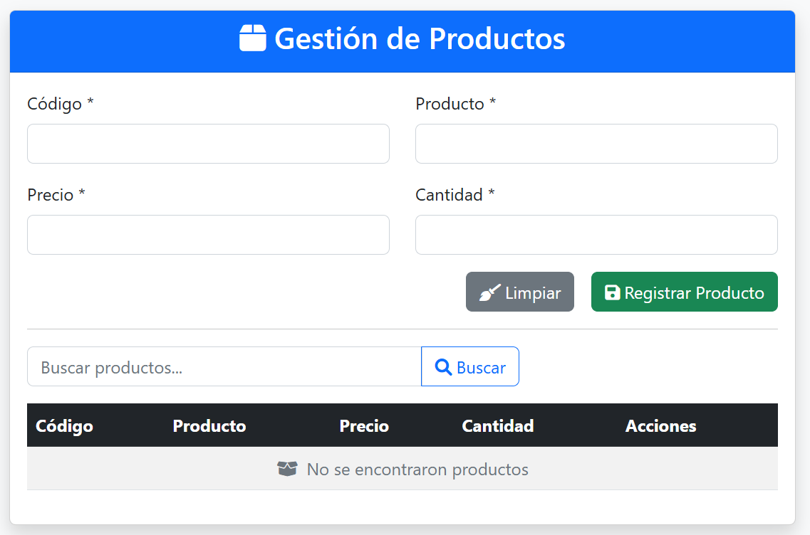

# 🛍️ Laboratorio CRUD - Sistema de Gestión de Productos con Fetch API

<p align="center">
    
</p>

<p align="center">
    
    
    
    
    
</p>

## 📋 Tabla de Contenidos
- [Introducción](#-introducción)
- [Requisitos Previos](#-requisitos-previos)
- [Instalación y Configuración](#-instalación-y-configuración)
- [Arquitectura del Sistema](#-arquitectura-del-sistema)
- [Base de Datos](#-base-de-datos)
- [Resultado del Laboratorio](#-resultado-del-laboratorio)
- [Dificultades y Soluciones](#-dificultades-y-soluciones)
- [Referencias](#-referencias)
- [Fecha de Ejecución](#-fecha-de-ejecución)
- [Desarrollador](#-desarrollador)

## 🎯 Introducción

Este laboratorio implementa un sistema completo de gestión de productos (CRUD) utilizando **Fetch API** para comunicación asíncrona, **PHP Orientado a Objetos** en el backend, y **MySQL** como sistema de gestión de base de datos. El objetivo principal es desarrollar un formulario web dinámico que permita realizar operaciones de creación, lectura, actualización y búsqueda de productos de manera eficiente y moderna.

### Objetivos del Laboratorio
- Implementar operaciones CRUD completas usando Fetch API
- Aplicar Programación Orientada a Objetos en PHP
- Desarrollar interfaz responsive con Bootstrap 5
- Integrar SweetAlert2 para notificaciones interactivas
- Implementar validaciones robustas en cliente y servidor

### Arquitectura del Sistema

```
📁 Estructura del Proyecto CRUD
├── 📁 Modelo/
│   ├── conexion.php          # 🗄️ Clase DB - Conexión PDO segura
│   └── Productos.php         # 🏷️ Clase Producto - Lógica de negocio
├── registrar.php             # 🎮 Controlador principal con switch
├── index.html               # 👁️ Vista principal del formulario
├── script.js                # ⚡ Lógica JavaScript con Fetch API
└── assets/
    └── css/
        └── styles.css       # 🎨 Estilos personalizados
```

**Descripción de Componentes:**
- **🗄️ Modelo/**: Contiene las clases PHP para gestión de datos y conexión a BD
- **🎮 Controlador**: `registrar.php` centraliza las operaciones mediante switch
- **👁️ Vista**: `index.html` presenta la interfaz de usuario con Bootstrap
- **⚡ JavaScript**: `script.js` maneja la comunicación asíncrona con Fetch API

## 🛠️ Requisitos Previos

### Prerrequisitos del Ecosistema de Desarrollo

| Componente | Versión Requerida | Descripción | Icono |
|------------|-------------------|-------------|--------|
| **PHP** | 7.4 o superior | Lenguaje de programación backend |  |
| **MySQL** | 5.7+ | Sistema de gestión de base de datos |  |
| **Apache/Nginx** | Última versión | Servidor web |  |
| **Navegador Web** | Moderno | Soporte para Fetch API y ES6+ |  |

### Entorno de Desarrollo Recomendado
- **🔧 Servidor Local**: XAMPP, WampServer, Laragon
- **💻 Editor de Código**: Visual Studio Code 
- **🖥 Sistema Operativo**: Windows 10/11, macOS, Linux
- **🌐 Navegador**: Chrome, Firefox, Edge (para pruebas)

## ⚙️ Instalación y Configuración

### 1. Configuración del Entorno de Desarrollo
```bash
# Crear directorio del proyecto
mkdir crud-productos
cd crud-productos

# Estructura de carpetas
mkdir Modelo assets assets/css
```

### 2. Configuración de Base de Datos
```sql
-- Crear base de datos
CREATE DATABASE productosdb;

-- Usar la base de datos
USE productosdb;

-- Crear tabla productos
CREATE TABLE productos (
    id INT AUTO_INCREMENT PRIMARY KEY,
    codigo VARCHAR(20) NOT NULL UNIQUE,
    producto VARCHAR(100) NOT NULL,
    precio DECIMAL(10,2) NOT NULL,
    cantidad INT NOT NULL,
    fecha_creacion TIMESTAMP DEFAULT CURRENT_TIMESTAMP
);
```

### 3. Configuración de Archivos PHP

#### Modelo/conexion.php
```php
<?php
class DB {
    private $pdo;
    
    public function __construct() {
        try {
            $this->pdo = new PDO(
                "mysql:host=localhost;dbname=productosdb;charset=utf8",
                "root",
                "",
                [
                    PDO::ATTR_ERRMODE => PDO::ERRMODE_EXCEPTION,
                    PDO::ATTR_DEFAULT_FETCH_MODE => PDO::FETCH_ASSOC
                ]
            );
        } catch (PDOException $e) {
            die("Error de conexión: " . $e->getMessage());
        }
    }
    
    public function insertSeguro($tabla, $datos) {
        // Implementación de inserción segura
    }
}
?>
```

### 4. Configuración de Headers para CORS
En `registrar.php`:
```php
<?php
header("Access-Control-Allow-Origin: *");
header("Access-Control-Allow-Methods: POST, GET, OPTIONS");
header("Access-Control-Allow-Headers: Content-Type");
header("Content-Type: application/json; charset=utf-8");

if ($_SERVER['REQUEST_METHOD'] == 'OPTIONS') {
    exit(0);
}
?>
```

## 🏗️ Arquitectura del Sistema

### Flujo de Comunicación
```
Frontend (index.html) 
    → JavaScript (Fetch API) 
    → Backend (registrar.php) 
    → Clase Producto (Productos.php) 
    → Clase DB (conexion.php) 
    → MySQL (productosdb)
```

### Estructura de Respuestas JSON
```json
{
    "success": true,
    "message": "Operación completada exitosamente",
    "accion": "Guardar",
    "errors": []
}
```

### Métodos Principales Implementados

#### Clase Producto
```php
class Producto {
    public function guardar() {
        // Lógica para guardar producto
    }
    
    public function editar() {
        // Lógica para editar producto
    }
    
    public function buscar($codigo) {
        // Lógica para buscar producto
    }
    
    public function validar() {
        // Validaciones de campos
    }
}
```

#### JavaScript - Fetch API
```javascript
async function enviarDatos(accion, formData) {
    try {
        const response = await fetch('registrar.php', {
            method: 'POST',
            body: formData
        });
        
        const data = await response.json();
        manejarRespuesta(data);
    } catch (error) {
        console.error('Error:', error);
    }
}
```

## 🗄️ Base de Datos

### Esquema de la Tabla Productos

```sql
CREATE TABLE productos (
    id INT AUTO_INCREMENT PRIMARY KEY,
    codigo VARCHAR(20) NOT NULL UNIQUE,
    producto VARCHAR(100) NOT NULL,
    precio DECIMAL(10,2) NOT NULL,
    cantidad INT NOT NULL,
    fecha_creacion TIMESTAMP DEFAULT CURRENT_TIMESTAMP
);
```

### Descripción de Campos

| Campo | Tipo | Descripción | Restricciones |
|-------|------|-------------|---------------|
| **id** | INT AUTO_INCREMENT | Identificador único | PRIMARY KEY |
| **codigo** | VARCHAR(20) | Código del producto | NOT NULL, UNIQUE |
| **producto** | VARCHAR(100) | Nombre del producto | NOT NULL |
| **precio** | DECIMAL(10,2) | Precio unitario | NOT NULL, ≥ 0 |
| **cantidad** | INT | Stock disponible | NOT NULL, ≥ 0 |
| **fecha_creacion** | TIMESTAMP | Fecha de registro | DEFAULT CURRENT_TIMESTAMP |

### Consultas Principales Implementadas

```sql
-- Insertar producto
INSERT INTO productos (codigo, producto, precio, cantidad) 
VALUES (?, ?, ?, ?);

-- Actualizar producto
UPDATE productos 
SET producto = ?, precio = ?, cantidad = ? 
WHERE codigo = ?;

-- Buscar producto
SELECT * FROM productos WHERE codigo = ?;

-- Listar todos los productos
SELECT * FROM productos ORDER BY fecha_creacion DESC;
```

## 🖼️ Resultado del Laboratorio

### 🎨 Interfaz Principal del Formulario


*Interfaz desarrollada con Bootstrap 5 que incluye todos los campos necesarios para gestionar productos con validación en tiempo real.*

### ✅ Operaciones Implementadas

#### 1. **Guardar Producto**
- Formulario con validación de campos obligatorios
- Prevención de códigos duplicados
- Mensajes de confirmación con SweetAlert2

#### 2. **Editar Producto** 
- Búsqueda por código para cargar datos existentes
- Actualización en tiempo real de la información
- Botones dinámicos (Registrar/Actualizar)

#### 3. **Buscar Producto**
- Búsqueda rápida por código de producto
- Visualización de resultados en la interfaz
- Manejo de productos no encontrados

### 🔔 Sistema de Notificaciones
- **SweetAlert2** para mensajes de éxito y error
- Alertas personalizadas por tipo de operación
- Interfaz de usuario intuitiva y profesional

### 🌐 URLs de la Aplicación
- **Página principal**: `http://localhost/crud-productos/index.html`
- **Endpoint API**: `http://localhost/crud-productos/registrar.php`

## ⚠️ Dificultades y Soluciones

### 1. 🚫 **Error de CORS en Peticiones Fetch**
**Problema encontrado:**
```
Access to fetch at 'http://localhost/registrar.php' from origin 'http://localhost:3000' 
has been blocked by CORS policy
```

**Solución aplicada:**
```php
// En registrar.php - al inicio del archivo
header("Access-Control-Allow-Origin: *");
header("Access-Control-Allow-Methods: POST, GET, OPTIONS");
header("Access-Control-Allow-Headers: Content-Type");
header("Content-Type: application/json; charset=utf-8");
```

### 2. 🔄 **Manejo de FormData con Fetch API**
**Problema:** Los datos no llegaban correctamente al servidor PHP.

**Solución:**
```javascript
// Configuración correcta de Fetch con FormData
const formData = new FormData(formulario);
fetch('registrar.php', {
    method: 'POST',
    body: formData
    // No establecer Content-Type manualmente
});
```

### 3. 🔢 **Validación de Campos Numéricos**
**Problema:** Los campos precio y cantidad llegaban como strings.

**Solución en PHP:**
```php
public function validarCampos() {
    if (!is_numeric($this->precio) || $this->precio <= 0) {
        $this->errors['precio'] = "El precio debe ser un número positivo";
    }
    
    // Conversión de tipos después de validar
    $this->precio = (float) $this->precio;
    $this->cantidad = (int) $this->cantidad;
}
```

### 4. 💾 **Problemas con Caracteres Especiales en JSON**
**Problema:** Caracteres especiales causaban errores en parse JSON.

**Solución:**
```php
ob_clean(); // Limpiar buffer de salida
header("Content-Type: application/json; charset=utf-8");
echo json_encode($response, JSON_UNESCAPED_UNICODE);
exit();
```

### 5. ⚡ **Prevención de Envíos Múltiples**
**Problema:** Usuario podía enviar múltiples peticiones simultáneas.

**Solución en JavaScript:**
```javascript
let enviando = false;

formulario.addEventListener('submit', async function(e) {
    e.preventDefault();
    
    if (enviando) return;
    
    enviando = true;
    botonSubmit.disabled = true;
    
    try {
        await enviarDatos();
    } finally {
        enviando = false;
        botonSubmit.disabled = false;
    }
});
```

## 📚 Referencias

### 1. 📖 **Documentación Oficial**
- **Fetch API MDN**: [https://developer.mozilla.org/es/docs/Web/API/Fetch_API](https://developer.mozilla.org/es/docs/Web/API/Fetch_API)
- **PHP PDO Documentation**: [https://www.php.net/manual/es/book.pdo.php](https://www.php.net/manual/es/book.pdo.php)
- **Bootstrap 5 Documentation**: [https://getbootstrap.com/docs/5.3/](https://getbootstrap.com/docs/5.3/)
- **SweetAlert2 Documentation**: [https://sweetalert2.github.io/](https://sweetalert2.github.io/)

### 2. 🎓 **Recursos de Aprendizaje**
- **JavaScript Info - Fetch**: [https://es.javascript.info/fetch](https://es.javascript.info/fetch)
- **PHP The Right Way**: [https://phptherightway.com/](https://phptherightway.com/)
- **MySQL Tutorial**: [https://www.mysqltutorial.org/](https://www.mysqltutorial.org/)

### 3. 🔧 **Herramientas de Desarrollo**
- **XAMPP**: [https://www.apachefriends.org/](https://www.apachefriends.org/)
- **VS Code**: [https://code.visualstudio.com/](https://code.visualstudio.com/)
- **MySQL Workbench**: [https://www.mysql.com/products/workbench/](https://www.mysql.com/products/workbench/)

## 📅 Fecha de Ejecución

**Laboratorio ejecutado el**: 14 de noviembre de 2025

**Duración estimada**: 6-8 horas de desarrollo y pruebas

**Entorno de ejecución**: 
- **🖥️ SO**: Windows 11 Pro
- **🔧 Servidor local**: XAMPP 8.2.4
- **💾 PHP**: 8.2.4
- **🗄️ MySQL**: 8.0.31
- **✏️ Editor**: Visual Studio Code 1.85.0

---

## 👨‍💻 Desarrollador

<div align="center">
    
    
    <h3>🎓 Información del Estudiante</h3>
</div>

---

**Este laboratorio ha sido desarrollado para la Universidad Tecnológica:**

<div align="center">

| Campo | Información |
|-------|-------------|
| 👤 **Nombre Completo** | [Eimy Félix 8-1010-2376 / Amanda Green 8-1023-1761] |
| 📧 **Correo Institucional** | eimy.felix@utp.ac.pa / amanda.green@utp.ac.pa|
| 📚 **Curso** | Ingeniería Web |
| 👩‍🏫 **Instructora** | Ing. Irina Fong |
| 🏫 **Grupo** | ISF132 |
| 📆 **Fecha de Entrega** | 14 de noviembre de 2025 |

</div>

### 💻 Tecnologías Aplicadas en Este Proyecto
<div align="center">
    
    
    
    
    
    
    
</div>

### 🎯 Habilidades Desarrolladas
- ✅ Programación Orientada a Objetos en PHP
- ✅ Comunicación asíncrona con Fetch API
- ✅ Diseño de interfaces con Bootstrap 5
- ✅ Validación de formularios en cliente y servidor
- ✅ Manejo de base de datos MySQL con PDO
- ✅ Implementación de operaciones CRUD completas

---

<div align="center">
    <h4>🏛 Universidad Tecnológica</h4>
    <p><em>Facultad de Ingeniería en Sistemas - Campus Victor Levis Sasso</em></p>
    <p>📅 <strong>Fecha de Entrega:</strong> 14 de noviembre de 2025</p>
    <p>📝 <strong>Modalidad:</strong> Laboratorio Práctico - Grupal</p>
    
    <br>
    
    
    
    
    <br><br>
    
    <p><strong>🎯 "Implementación exitosa de sistema CRUD con tecnologías web modernas"</strong></p>
</div>

---

<div align="center">
    <sub>💡 README.md generado como parte de la documentación del laboratorio práctico</sub><br>
    <sub>🔄 Proyecto académico desarrollado bajo supervisión de Ing. Irina Fong</sub>
</div>
